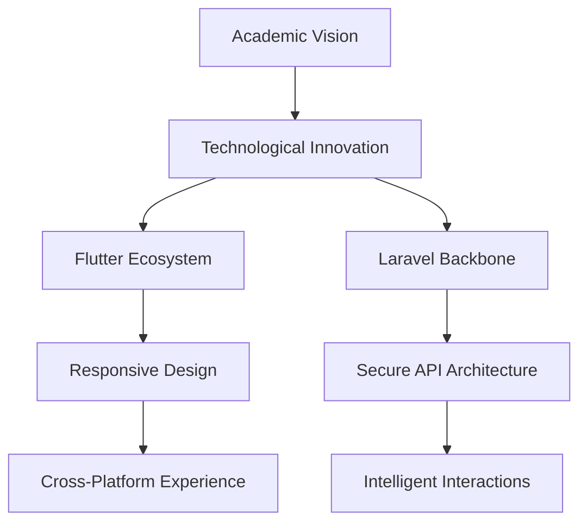

# 🌟 ALUfree Media | The Digital Academic Revolution


## 🚀 Manifesto: Reimagining Academic Connectivity

### When Technology Meets Purpose

ALUfree Media is not just an application—it's a movement. A bold declaration that student voices deserve a platform as dynamic, intelligent, and transformative as their potential.

## 🌈 Our Philosophical Framework

### The 5 Pillars of Digital Academic Excellence

1. 🔓 **Democratized Knowledge**
   - Breaking institutional barriers
   - Enabling global academic dialogue

2. 🤝 **Collaborative Intelligence**
   - Transforming competition into collaboration
   - Creating a unified learning ecosystem

3. 🛡️ **Ethical Digital Citizenship**
   - Protecting academic integrity
   - Fostering responsible digital interaction

4. 📊 **Data-Driven Insights**
   - Intelligent content recommendation
   - Personalized learning pathways

5. 🌐 **Universal Accessibility**
   - Transcending geographical limitations
   - Inclusive design philosophy

## 🔬 Technological Symphony

### Architectural Masterpiece



## 💡 Revolutionary Features

| Feature Category | Innovation | Technological Backbone |
|-----------------|------------|------------------------|
| 🧠 Intelligent Content | AI-Powered Filtering | Machine Learning Algorithms |
| 🔒 Secure Collaboration | Zero-Compromise Security | Multi-Layer Authentication |
| 📈 Performance Optimization | Adaptive User Experience | Reactive Programming |
| 🌍 Global Connectivity | Borderless Academic Network | Microservice Architecture |

## 🛠 Technical Constellation

### Frontend: Flutter Elegance
- 🚀 Reactive Framework
- 💻 Native Performance
- 🎨 Adaptive Design System

### Backend: Laravel Precision
- 🔐 Advanced Authentication
- 📡 Microservice-Ready API
- 🗃️ Elegant ORM Implementation

## 🚀 Rapid Deployment Protocol

### Backend Initialization
```bash
# Clone the Academic Innovation Repository
git clone https://github.com/alufree/academic-platform.git
cd alufree-backend

# Prepare Deployment Environment
composer install
cp .env.example .env
php artisan key:generate
php artisan migrate:fresh --seed
php artisan passport:install

# Launch Mission Control
php artisan serve
```

### Frontend Mobilization
```bash
# Retrieve Frontend Ecosystem
git clone https://github.com/alufree/mobile-experience.git
cd alufree-frontend

# Initialize Technological Readiness
flutter pub get
flutter run --release
```

## 🔐 Cybersecurity Manifesto

### Multilayered Defense Strategy
- 🛡️ Quantum-Inspired Token Authentication
- 🔬 End-to-End Encryption
- 🤖 Predictive Threat Intelligence
- 📋 Continuous Compliance Monitoring

## 🌐 Evolutionary Roadmap

### Beyond Boundaries: Future Horizons
- [ ] Global Learning Network
- [ ] Adaptive AI Recommendations
- [ ] Inter-Institutional Collaboration
- [ ] Predictive Learning Analytics
- [ ] Blockchain-Verified Achievements

## 🤝 Collaborative Ecosystem

### Join the Academic Transformation

1. 🍴 Fork the Vision
2. 🌿 Create Innovative Branches
3. 💡 Commit Groundbreaking Concepts
4. 🚀 Push Technological Boundaries
5. 🔀 Propose Collaborative Futures

## 📄 Open Source Liberation

**License**: MIT - Freedom to Innovate Responsibly

## 🌟 Impact Visualization


## 📞 Connect. Disrupt. Elevate.

**Vision Email**: vision@alufree.global
**Innovation Hub**: Student Transformation Collective
**Thought Leadership**: @AcademicInnovators

---

### 🌍 Engineered by Visionaries, Powered by Potential

**ALUfree Media: Redefining the Academic Experience** 🚀🌐

[](https://github.com/sponsors/alufree)
