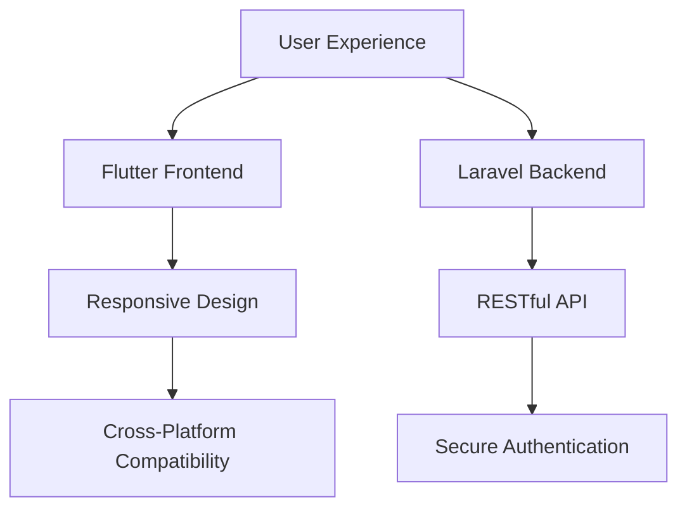

# 🌍 ALUfree Media | Beyond Social, Beyond Boundaries


## 🚀 The Origin Story: Reimagining Student Collaboration

### When Innovation Meets Necessity

In the dynamic world of academic communication, students have been yearning for a platform that transcends traditional social media. ALUfree Media isn't just an app—it's a movement, a digital revolution designed to empower, connect, and elevate student voices worldwide.

## 💡 Our Manifesto: Democratizing Academic Interaction

### More Than Just an App - A Digital Ecosystem

We believe that knowledge should flow freely, barriers should crumble, and student creativity should know no limits. ALUfree Media is our answer to the fragmented, impersonal digital landscapes of today.

## 🔬 Technological Breakthrough

### Architecture of Excellence



## 🌐 Key Innovations

### Transformative Features

| Feature | Impact | Technology |
|---------|--------|------------|
| 📝 Smart Content Sharing | Intelligent, Contextual Posting | AI-Powered Filtering |
| 🤝 Collaborative Spaces | Break Geographical Barriers | Real-Time Interactions |
| 🔒 Hyper-Secure Environment | Academic Integrity Protection | Multi-Layer Authentication |
| 📊 Analytical Insights | Personal & Institutional Learning | Data-Driven Recommendations |

## 🛠 Technical Architecture

### Frontend: Flutter Mastery
- 💻 Dart-Powered Elegance
- 🎨 Adaptive UI/UX
- ⚡ High-Performance Rendering

### Backend: Laravel Precision
- 🔐 Passport Authentication
- 📡 RESTful API Design
- 🗃️ Eloquent ORM Optimization

## 🚀 Quickstart: From Zero to Innovation

### Backend Initialization
```bash
# Clone the Academic Revolution
git clone https://github.com/alufree/backend.git
cd alufree-backend

# Prepare Your Battlefield
composer install
cp .env.example .env
php artisan key:generate
php artisan migrate:fresh
php artisan passport:install

# Launch Mission Control
php artisan serve
```

### Frontend Deployment
```bash
# Mobilize Your Frontend
git clone https://github.com/alufree/frontend.git
cd alufree-frontend

# Power Up
flutter pub get
flutter run
```

## 🔐 Security: Our Sacred Promise

### Multi-Dimensional Protection Strategy
- 🛡️ JWT Token Authentication
- 🔬 Advanced Encryption Protocols
- 🤖 AI-Powered Content Moderation
- 📋 Comprehensive Compliance Checks

## 🌈 Vision Beyond Code

### Our Roadmap to Transformation

- [ ] Global Learning Network
- [ ] Machine Learning Recommendations
- [ ] Cross-Institutional Collaboration
- [ ] Inclusive Design Ecosystem

## 🤝 Community Collaboration

### Join the Academic Revolution

1. 🍴 Fork the Vision
2. 🌿 Create Your Innovation Branch
3. 💡 Commit Groundbreaking Ideas
4. 🚀 Push Boundaries
5. 🔀 Pull Request Your Future

## 📄 Open Source Liberation

**License**: MIT - Freedom to Innovate

## 🌟 Impact Metrics


## 📞 Connect. Collaborate. Create.

**Email**: revolution@alufree.media
**Discord**: Student Innovation Nexus
**Twitter**: @ALUfreeInnovate

---

### 🌍 Crafted by Students, Powered by Possibilities

**ALUfree Media: Where Every Interaction Sparks Learning** 🚀📚

[](https://github.com/sponsors/alufree)
