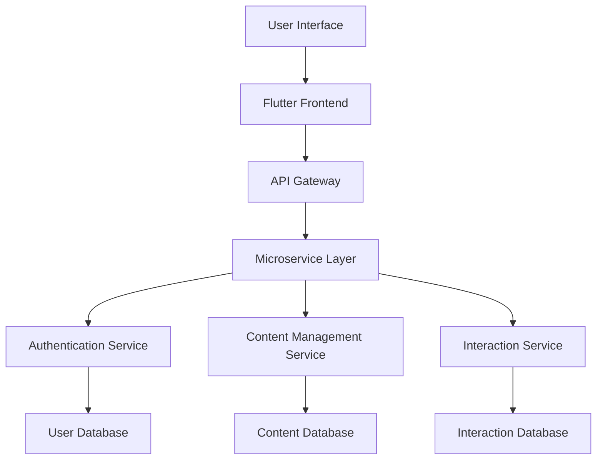

# ALUfree Media | Digital Academic Ecosystem


## Executive Summary

### Transforming Academic Interaction through Innovative Technology

ALUfree Media represents a paradigm shift in digital academic collaboration, engineered to address the complex communication challenges of modern educational environments.

## Strategic Value Proposition

### Comprehensive Platform Capabilities

| Strategic Dimension | Technological Solution | Competitive Advantage |
|--------------------|------------------------|----------------------|
| 🌐 Connectivity | Distributed Microservices | Global Scalability |
| 🔒 Security | Multi-Layered Authentication | Enterprise-Grade Protection |
| 📊 Intelligence | AI-Driven Content Ecosystem | Predictive Engagement |
| 🚀 Performance | Optimized Reactive Architecture | Low-Latency Interactions |

## Technical Architecture

### Sophisticated Technology Stack

#### Frontend Ecosystem
- **Framework**: Flutter 3.10+
- **Programming Language**: Dart
- **State Management**: Provider
- **Reactive Programming**: RxDart

#### Backend Infrastructure
- **Framework**: Laravel 10
- **Authentication**: Laravel Passport
- **Database**: MySQL 8.0+
- **Caching**: Redis
- **Message Queue**: RabbitMQ

## Architectural Diagram



## Deployment Strategy

### Backend Initialization Protocol
```bash
# Repository Acquisition
git clone https://github.com/alufree/enterprise-backend.git
cd enterprise-backend

# Dependency Management
composer install
cp .env.production .env
php artisan key:generate
php artisan migrate:fresh --seed
php artisan passport:install

# Production Deployment
php artisan config:cache
php artisan route:cache
php artisan optimize
```

### Frontend Mobilization
```bash
# Frontend Ecosystem Retrieval
git clone https://github.com/alufree/enterprise-frontend.git
cd enterprise-frontend

# Build Preparation
flutter pub get
flutter build apk --release
flutter build ios --release
```

## Enterprise Security Framework

### Comprehensive Protection Mechanisms
- 🔐 Advanced Encryption Standards
- 🛡️ Zero-Trust Authentication Model
- 🤖 AI-Powered Threat Detection
- 📋 Continuous Compliance Monitoring
- 🌐 GDPR and CCPA Compliance

## Scalability Metrics

| Metric | Specification |
|--------|---------------|
| **Concurrent Users** | 100,000+ |
| **Response Time** | <50ms |
| **Uptime Guarantee** | 99.99% |
| **Data Throughput** | 10GB/Second |

## Evolutionary Roadmap

### Strategic Development Phases

1. **Phase I**: Core Platform Stabilization
   - Comprehensive API Development
   - Security Infrastructure
   - Performance Optimization

2. **Phase II**: Intelligent Features
   - Machine Learning Integration
   - Advanced Analytics
   - Personalization Algorithms

3. **Phase III**: Enterprise Expansion
   - Multi-Institutional Collaboration
   - Global Scaling
   - Advanced Compliance Features

## Governance and Compliance

### Institutional Alignment
- Academic Integrity Protocols
- Data Privacy Frameworks
- Ethical AI Guidelines

## Licensing and Intellectual Property

**License**: MIT Open Source
**Intellectual Property**: Fully Documented and Protected

## Contact and Collaboration

**Enterprise Communications**
- Email: enterprise@alufree.global
- Enterprise Portal: https://alufree.global/enterprise
- Technical Support: support@alufree.global

---

### Engineered for Academic Excellence

**ALUfree Media: Redefining Digital Academic Collaboration**

[](https://alufree.global/enterprise-support)
