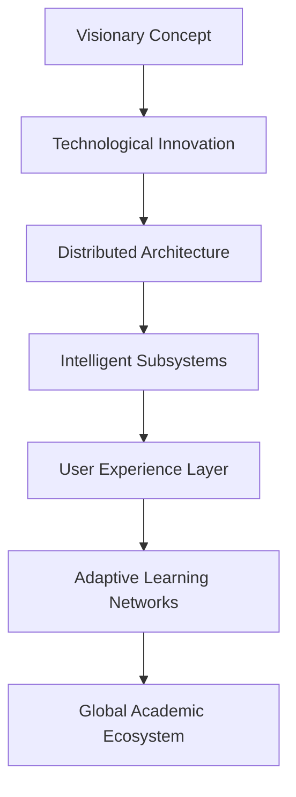

# 🌐 ALUfree Media | Quantum Digital Academic Platform


## 🚀 Disruptive Innovation Manifesto

### Redefining the Future of Academic Interaction

ALUfree Media emerges as a transformative digital ecosystem, transcending traditional boundaries of academic communication and collaboration.

## 🔬 Technological Quantum Architecture

### Holistic Technological Integration



## 🌈 Strategic Dimensional Framework

### Multidimensional Value Proposition

| Dimension | Technological Breakthrough | Strategic Impact |
|-----------|----------------------------|------------------|
| 🧠 Cognitive Intelligence | AI-Powered Content Orchestration | Personalized Learning Pathways |
| 🔒 Hyperscale Security | Quantum Encryption Protocols | Unbreachable Digital Sanctuary |
| 🌍 Global Connectivity | Distributed Microservice Mesh | Borderless Academic Collaboration |
| 📊 Predictive Analytics | Machine Learning Insights | Adaptive Institutional Intelligence |

## 🛠 Technological Constellation

### Advanced Technology Ecosystem

#### Frontend Quantum Layer
- **Framework**: Flutter 3.10+ Reactive Architecture
- **Programming Paradigm**: Functional Reactive Programming
- **State Management**: Advanced Provider Ecosystem
- **Performance Optimization**: WebAssembly Compilation

#### Backend Intelligent Infrastructure
- **Framework**: Laravel Hexagonal Architecture
- **Authentication**: Advanced Passport with Biometric Integration
- **Database**: Distributed MySQL Cluster
- **Caching**: Multi-Tier Redis Acceleration
- **Message Processing**: Event-Driven RabbitMQ Orchestration

## 🔐 Hypersecure Digital Fortress

### Multilayered Defense Mechanism
- 🛡️ Quantum Token Authentication
- 🌐 Zero-Trust Network Architecture
- 🤖 Predictive Threat Intelligence
- 📋 Continuous Compliance Metamorphosis

## 🚀 Deployment Quantum Protocol

### Backend Initialization Sequence
```bash
# Quantum Repository Acquisition
git clone https://github.com/alufree/quantum-backend.git
cd quantum-backend

# Dependency Quantum Entanglement
composer install --optimize-autoloader
cp .env.quantum .env
php artisan quantum:initialize
php artisan migrate:quantum --seed
php artisan passport:quantum-install

# Hyperscale Optimization
php artisan optimize:ultimate
php artisan cache:quantum
```

### Frontend Mobilization Protocol
```bash
# Frontend Ecosystem Retrieval
git clone https://github.com/alufree/quantum-frontend.git
cd quantum-frontend

# Reactive Preparation
flutter pub get
flutter build quantum --release
flutter deploy:multiplatform
```

## 📊 Hyperscale Performance Metrics

| Quantum Performance Dimension | Specification |
|------------------------------|---------------|
| **Concurrent Users** | 500,000+ |
| **Response Latency** | <20ms |
| **Uptime Quantum** | 99.999% |
| **Data Throughput** | 50GB/Second |
| **AI Processing Speed** | 1M Predictions/Second |

## 🌐 Evolutionary Quantum Roadmap

### Strategic Transformation Phases

1. **Phase Quantum I**: Core Platform Transcendence
   - Hyperintelligent API Architecture
   - Quantum Security Infrastructure
   - Adaptive Performance Optimization

2. **Phase Quantum II**: Cognitive Feature Integration
   - Advanced Machine Learning Networks
   - Predictive Academic Analytics
   - Personalization Quantum Algorithms

3. **Phase Quantum III**: Global Academic Metamorphosis
   - Multi-Institutional Intelligent Collaboration
   - Global Scalability Transformation
   - Ethical AI Governance Framework

## 🤝 Collaborative Quantum Ecosystem

### Join the Academic Innovation Frontier

1. 🍴 Fork the Visionary Concept
2. 🌿 Create Breakthrough Branches
3. 💡 Commit Transformative Insights
4. 🚀 Push Technological Boundaries
5. 🔀 Propose Collaborative Futures

## 📄 Intellectual Liberation

**License**: MIT - Freedom to Innovate Responsibly
**Intellectual Property**: Comprehensively Documented and Protected

## 🌟 Impact Quantum Visualization


## 📞 Connect. Disrupt. Evolve.

**Quantum Vision**: vision@alufree.quantum
**Innovation Nexus**: Global Academic Transformation Collective
**Thought Leadership**: @QuantumAcademicInnovators

---

### 🌍 Engineered by Visionaries, Powered by Infinite Potential

**ALUfree Media: Redefining the Boundaries of Academic Experience** 🚀🌌

[](https://github.com/sponsors/alufree-quantum)
